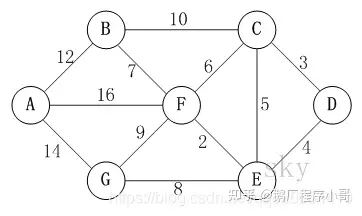
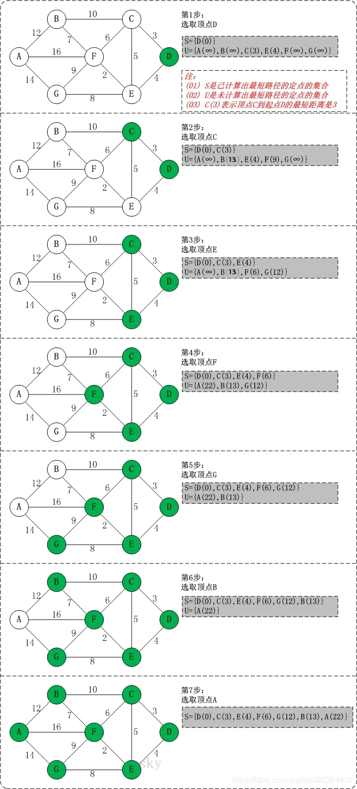

## 最短路径算法-迪杰斯特拉(Dijkstra)算法
迪杰斯特拉(Dijkstra)算法是典型最短路径算法，用于计算一个节点到其他节点的最短路径。
它的主要特点是以起始点为中心向外层层扩展(广度优先遍历思想)，直到扩展到终点为止。

## 基本思想

* 通过Dijkstra计算图G中的最短路径时，需要指定一个起点D(即从顶点D开始计算)。
* 此外，引进两个数组S和U。S的作用是记录已求出最短路径的顶点(以及相应的最短路径长度)，而U则是记录还未求出最短路径的顶点(以及该顶点到起点D的距离)。
* 初始时，数组S中只有起点D；数组U中是除起点D之外的顶点，并且数组U中记录各顶点到起点D的距离。如果顶点与起点D不相邻，距离为无穷大。
* 然后，从数组U中找出路径最短的顶点K，并将其加入到数组S中；同时，从数组U中移除顶点K。接着，更新数组U中的各顶点到起点D的距离。
* 重复第4步操作，直到遍历完所有顶点。

## 迪杰斯特拉(Dijkstra)算法图解
参考：https://zhuanlan.zhihu.com/p/346558578

以上图为例，来对迪杰斯特拉进行算法演示(以顶点D为起点)。

**初始状态：S是已计算出最短路径的顶点集合，U是未计算除最短路径的顶点的集合！**

**第1步：将顶点D加入到S中。**
此时，S={D(0)}, U={A(∞),B(∞),C(3),E(4),F(∞),G(∞)}。 注:C(3)表示C到起点D的距离是3。

**第2步：将顶点C加入到S中。**

上一步操作之后，U中顶点C到起点D的距离最短；因此，将C加入到S中，同时更新U中顶点的距离。以顶点F为例，之前F到D的距离为∞；但是将C加入到S之后，F到D的距离为9=(F,C)+(C,D)。
此时，S={D(0),C(3)}, U={A(∞),B(13),E(4),F(9),G(∞)}。

**第3步：将顶点E加入到S中。**

上一步操作之后，U中顶点E到起点D的距离最短；因此，将E加入到S中，同时更新U中顶点的距离。还是以顶点F为例，之前F到D的距离为9；但是将E加入到S之后，F到D的距离为6=(F,E)+(E,D)。
此时，S={D(0),C(3),E(4)}, U={A(∞),B(13),F(6),G(12)}。

**第4步：将顶点F加入到S中。**

此时，S={D(0),C(3),E(4),F(6)}, U={A(22),B(13),G(12)}。

**第5步：将顶点G加入到S中。**

此时，S={D(0),C(3),E(4),F(6),G(12)}, U={A(22),B(13)}。

**第6步：将顶点B加入到S中。**

此时，S={D(0),C(3),E(4),F(6),G(12),B(13)}, U={A(22)}。

**第7步：将顶点A加入到S中。**

此时，S={D(0),C(3),E(4),F(6),G(12),B(13),A(22)}。

**此时:**

起点D到各个顶点的最短距离就计算出来了：A(22) B(13) C(3) D(0) E(4) F(6) G(12)。

## Java代码实现
